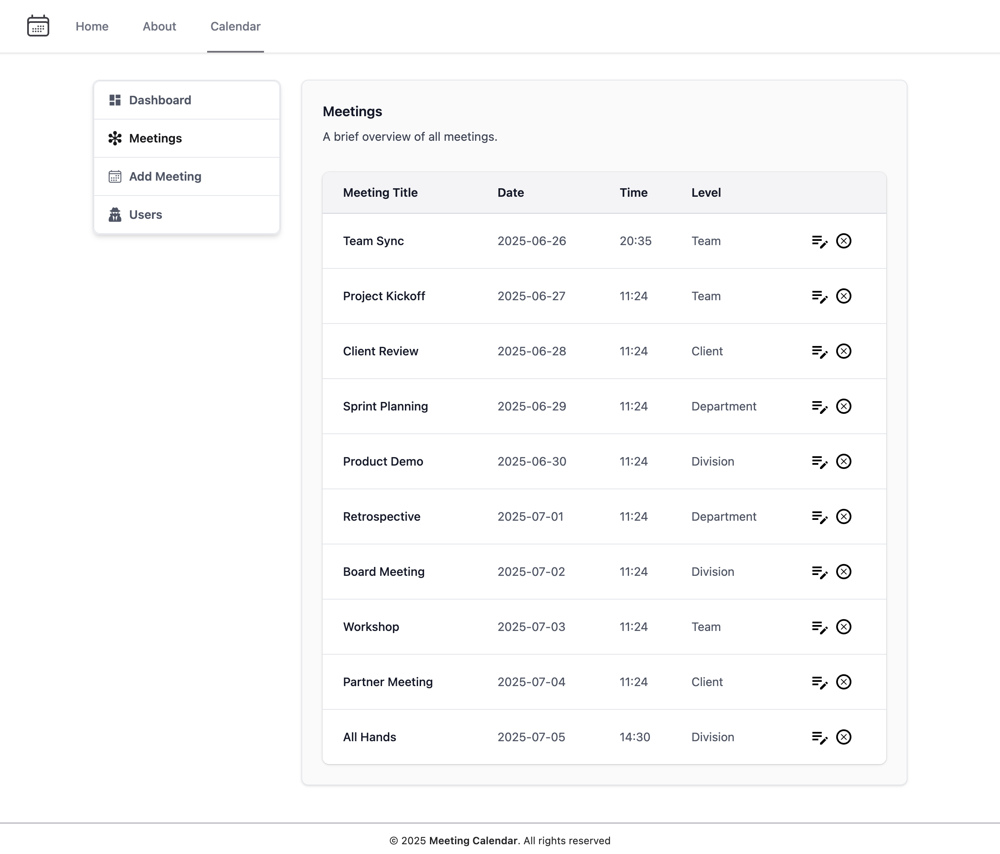
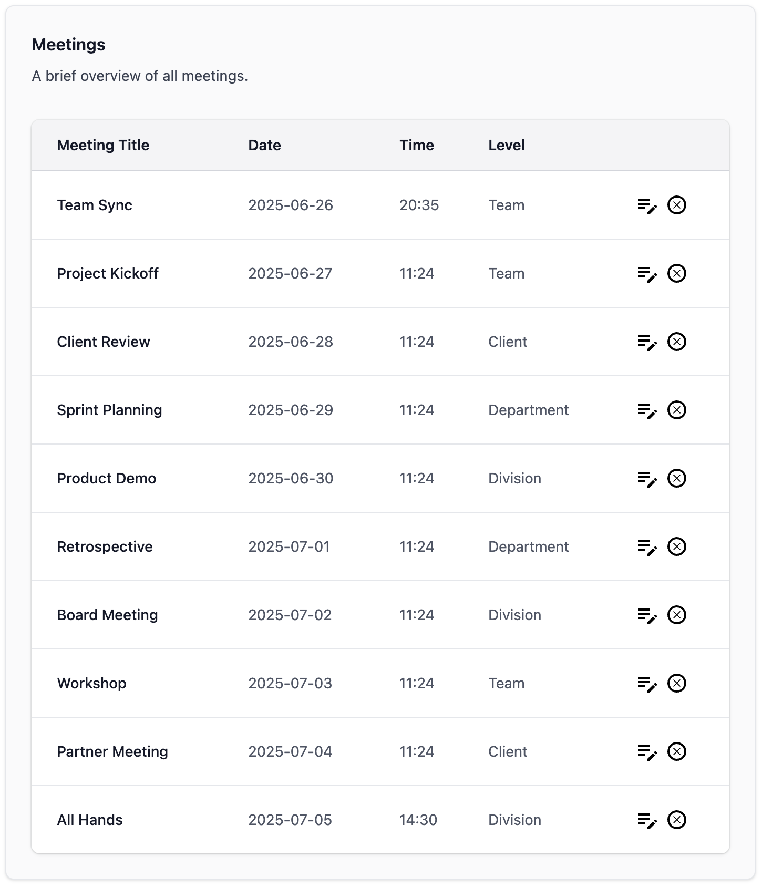
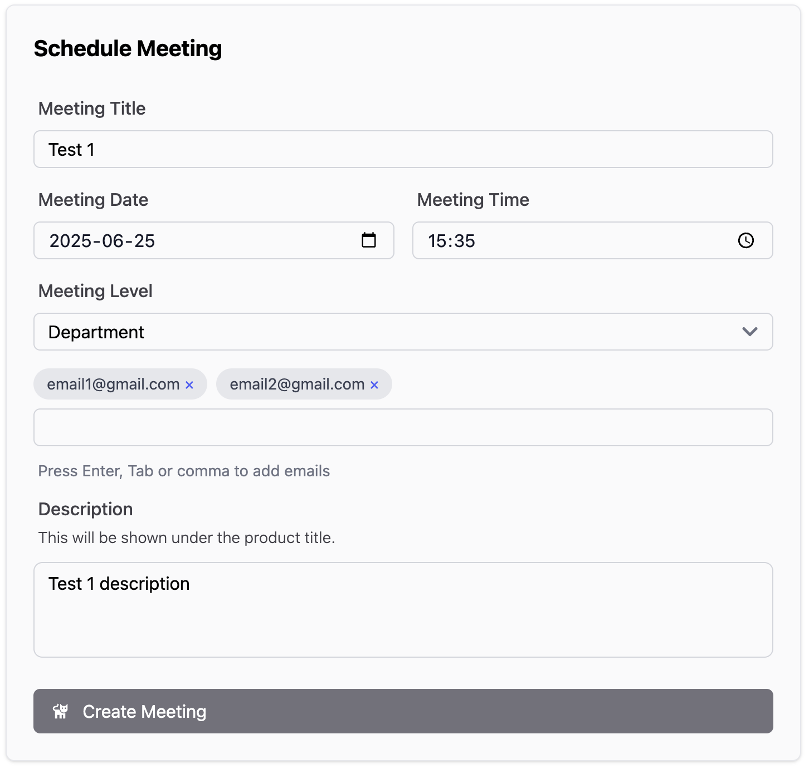
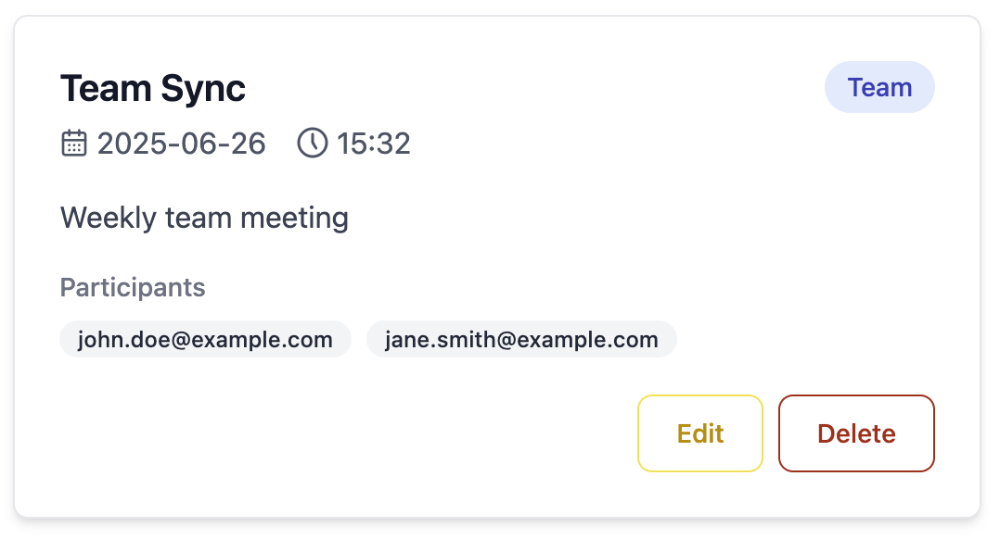
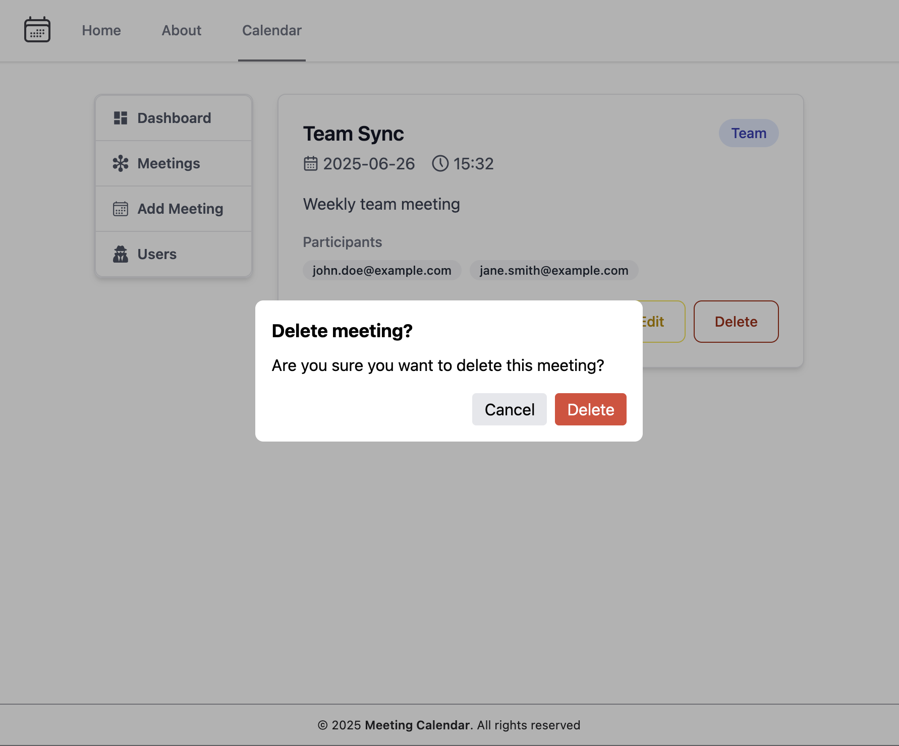

# Meeting Calendar - React Frontend



A responsive CRUD application for managing meetings, built with Vite + React, connected to a [Spring Boot backend API](https://github.com/fZ0x539/MeetingCalendarApi).

## Features

- View all meetings in a paginated list
- Create new meetings with form validation
- Edit existing meetings
- Delete meetings with confirmation
- **Optimistic UI updates** for smooth user experience
- **custom Tailwind CSS styling**
- Client-side caching with Tanstack Query
- Form validation with React Hook Form + Zod

## Technologies Used

- ⚛️ React 19 - With functional components and hooks
- 🔄 Tanstack Query - For data fetching, caching, and optimistic mutations
- 📝 React Hook Form + Zod - For form handling and validation
- 🛣️ React Router - For client-side routing
- 🎨 Tailwind CSS - For custom utility-first styling

## Getting Started

### Prerequisites

- Node.js (v16 or higher recommended)
- npm, yarn or pnpm
- Running instance of the [backend API](https://github.com/fZ0x539/MeetingCalendarApi)

### Installation

1. Clone the repository:

   ```bash
   git clone https://github.com/fZ0x539/g54-rf1-workshop.git
   cd g54-rf1-workshop
   ```

2. Install dependencies:
   ```bash
   npm install
   # or
   pnpm install
   # or
   yarn install
   ````

3. Change the API URL to match yours:

   ```typescript
   // /src/constants.ts
   export const API_BASEURL = "http://localhost:8080/api";
   ```

4. Start the development server:

   ```bash
   npm run dev
   # or
   pnpm vite
   # or
   yarn dev
   ```

5. Open your browser and navigate to:

   ```
   http://localhost:5173
   ```


## Application Structure

### Key Components

1. **Meeting List** (`/calendar/meetings`)
   - Displays all meetings in a paginated table
   - Each row has actions for edit/delete

    


2. **Meeting Form** (`/calendar/meetings/add` or `/calendar/meetings/:id/edit`)
   - Reusable component for both creating and editing meetings
   - Form validation with Zod schema
   - Error handling for API requests
   - **EmailTagInput**
     - Implements real-time email validation using regex
     - Manages internal state for tag collection
     - Exposes value through RHF Controller
     - Features:
     - Keyboard-driven UX (Enter/Tab to add)
     - Visual feedback for invalid emails
     - Customizable badge styling via Tailwind
     - Accessibility support (ARIA labels)


    

3. **Meeting Item** (`/calendar/meetings/:id`)
    -Displays the full meeting information
    -Includes both Edit & Delete buttons



4. **Custom Confirmation Modal**
    -Loosely coupled, ready to be re-used elsewhere
    -Accessible UX can be dismissed either by clicking outside the area or the ESC-key



### Advanced Features

#### Optimistic Mutations

The application implements several `useMutation` hooks with optimistic updates for:

- Creating new meetings (immediately shows in UI while API request processes)
- Editing existing meetings (instant UI update before confirmation)
- Deleting meetings (removes from UI immediately with rollback on error)

Example mutation:

```typescript
const { mutate } = useMutation({
  mutationFn: updateMeeting,
  onMutate: async (newMeeting) => {
    await queryClient.cancelQueries(["meetings"]);
    const previousMeetings = queryClient.getQueryData(["meetings"]);

    queryClient.setQueryData(["meetings"], (old: Meeting[]) =>
      old.map((meeting) =>
        meeting.id === newMeeting.id ? newMeeting : meeting
      )
    );

    return { previousMeetings };
  },
  onError: (err, newMeeting, context) => {
    queryClient.setQueryData(["meetings"], context.previousMeetings);
  },
  onSettled: () => {
    queryClient.invalidateQueries(["meetings"]);
  },
});
```
